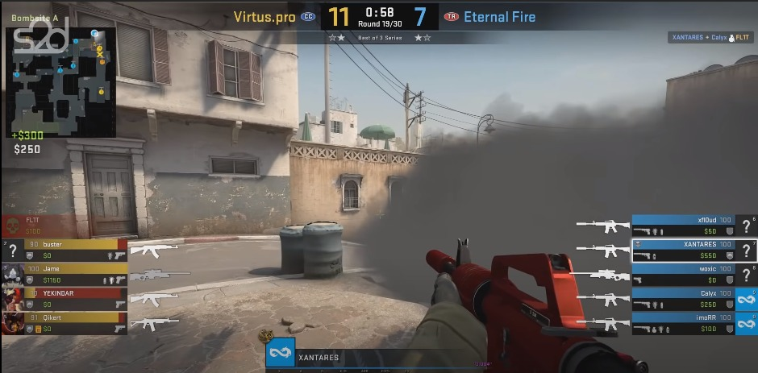
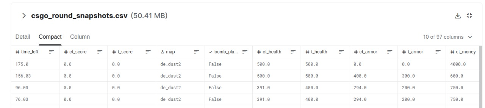
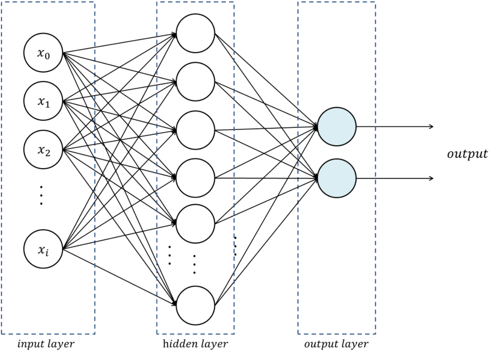

## Equipe
 - Lucas Dolsan
## Problema
O problema deste trabalho trata-se da **classificação** do resultado de **uma rodada** de uma partida de **Counter Strike: Global Offensive**, sendo vitória do time "*Counter-Terrorists*" (CT) ou vitória do time "*Terrorists*" (TR).


## Dataset
O dataset escolhido para o desenvolvimento deste classificador foi retirado do [Kaggle](https://kaggle.com),
e é constituído em diversos _snapshots_ do estado atual de uma partida de **Counter Strike: Global Offensive.**

Este é um screenshot de uma rodada em andamento.



Uma partida de **CS:GO** resulta num arquivo local na máquina de cada um dos 10 jogadores.
O arquivo é um `.dem` (demo), que pode ser aberto em uma instância do jogo para assistir a partida jogada, ou exportado para ferramentas de terceiros para realizar _parsing_.

Existem diversas informações relevantes para determinar a qual time possui maior chance de vitória, aqui são algumas das colunas extraídas de uma rodada de uma partida.



Disponível em: <https://www.kaggle.com/christianlillelund/csgo-round-winner-classification>

Existem outras implementações de IA que conseguem prever resultados da conclusão de uma partida, alguns campeonatos frequentemente utilizam previsões em uma transmissão 
para dar mais informação para o público. Infelizmente não consegui encontrar muita informação a respeito da IA demonstrada abaixo:


O dataset em questão não leva em consideração uma infinidade de fatores importantes para a decisão final de uma rodada, um exemplo disto é justamente a imagem demonstrada acima,
no qual a IA preveu uma chance de 5% de vitória, para o time TR, que no final das contas foi o time vitorioso desta rodada em questão.

### o que é o Counter Strike:Global Offensive (CS:GO)
É um jogo online desenvolvido pela [Valve](https://www.valvesoftware.com/pt-br/).
O jogo coloca duas equipes, Terroristas (TR) e Contra-Terroristas (CT), uma contra a outra em diferentes modos de jogo baseados em objetivos. O modo de jogo mais comum (contemplado por este dataset) envolve os Terroristas plantando uma bomba enquanto os Contra-Terroristas tentam detê-los.

## Técnica
A técnica utilizada foi a de um **classificador**, implementado com uma estrutura **Multi-Layer Perceptron**, utilizando a biblioteca para aprendizado de _machine learning_ **Scikit Learn**, implementada em **Python**.

O objetivo do **classificador** é conseguir indicar qual dos dois times (CT, TR) será o vencedor de uma rodada em questão, ou seja, o **classificador** desenvolvido nesse projeto é do tipo *binário*.

Existem inúmeras vantagens de se usar o Scikit Learn, especialmente para projetos que tem como objetivo o aprendizado na área de _machine learning_, pois existem inúmeras funções pré-implementadas, para pré-processamento, treinamento e métricas de avaliação, sem falar dos datasets incluídos diretamente na biblioteca.

A estrutura da rede em questão segue o seguinte modelo:



A camada de entrada possui um neurônio para cada característica de um registro do dataset, ou seja, para cada coluna do dataset, portanto são 96 neurônios de entrada.

### Métricas de avaliação
        Definição binária para o classificador (relevantes para f1, especificidade, matriz de confusão, etc):
            - Resultado "positivo": Vitória do time CT
            - Resultado "negativo": Vitória do time TR

        accuracy: Acurácia
        precision: Precisão
        recall: Recall
        f1: F1 Score
        specificity: Especificidade
        cross_validation_score: Validação cruzada (kfold de 10 iterações)
        cross_validation_mean: Média da validação cruzada
        cross_validation_std: Desvio padrão da validação cruzada
        confusion_matrix_args: Matriz de confusão

### Resultados obtidos
Foram realizados diversos experimentos, modificando uma série de parâmetros diferentes.
O treinamento foi baseado em um conjunto de parâmetros, a maior parte deles são os valores padrões do **MLPClassifier** do **SKLearn**.

Os experimentos realizados foram feitos em grupos, nessa sequência:

- **Camadas ocultas**
- **Funções de ativação**
- **Otimizações (Solvers)**
- **Tamanhos de lote**

Ao finalizar um grupo de testes, a combinação de parâmetros que resultou
nas melhores métricas, será preservada ao avançar para o próximo grupo de testes.

Todos os testes foram realizados utilizando o mesmo computador, que possui a seguinte configuração.

        OS: Debian GNU/Linux 11 (bullseye) x86_64 
        Kernel: 5.10.0-10-amd64 
        DE: Xfce 4.16 
        CPU: Intel i5-8600K (6 cores) @ 4.10GHz 
        RAM: 16GB DDR4 
        Python v3.9.2

#### Melhor resultado (v14-full_dataset)

A melhor versão encontrada, entre todos os grupos de teste, foi a **v14-full_dataset**.

Essa configuração está no primeiro grupo de testes, todos os testes realizados posteriormente,

**não resultaram em nenhuma melhoria significativa**.

#### Camadas ocultas:
Configurações utilizadas:
 - Uma camada oculta, com 30 neurônios **(v0-full_dataset)**;
```
"accuracy": 0.77,
"precision": 0.77,
"recall": 0.79,
"f1": 0.77,
"specificity": 0.79,
"cross_validation_score": [
    0.75, 0.76, 0.75,
    0.75, 0.75, 0.76,
    0.75, 0.75, 0.76,
    0.75
],
"cross_validation_mean": 0.76,
"cross_validation_std": 0.0,
"confusion_matrix_args": [
    [15657, 4115],
    [5068, 15556]
]
```
 - Uma camada oculta, com 180 neurônios **(v1-full_dataset)**;
```
"accuracy": 0.81,
"precision": 0.81,
"recall": 0.81,
"f1": 0.81,
"specificity": 0.81,
"cross_validation_score": [
    0.77, 0.78, 0.76,
    0.77, 0.78, 0.76,
    0.76, 0.78, 0.76,
    0.77
],
"cross_validation_mean": 0.77,
"cross_validation_std": 0.01,
"confusion_matrix_args": [
    [15962, 3818],
    [3735, 16881]
]
```
 - Uma camada oculta, com 60 neurônios **(v2-full_dataset)**;
```
"accuracy": 0.79,
"precision": 0.79,
"recall": 0.8,
"f1": 0.79,
"specificity": 0.8,
"cross_validation_score": [
    0.76, 0.76, 0.75,
    0.75, 0.76, 0.76,
    0.75, 0.77, 0.75,
    0.76
],
"cross_validation_mean": 0.76,
"cross_validation_std": 0.01,
"confusion_matrix_args": [
    [15891, 3864],
    [4623, 16018]
]
```
 - Uma camada oculta, com 120 neurônios **(v3-full_dataset)**;
```
"accuracy": 0.8,
"precision": 0.8,
"recall": 0.78,
"f1": 0.79,
"specificity": 0.78,
"cross_validation_score": [
    0.77, 0.77, 0.78,
    0.77, 0.77, 0.76,
    0.77, 0.76, 0.76,
    0.77
],
"cross_validation_mean": 0.77,
"cross_validation_std": 0.0,
"confusion_matrix_args": [
    [15379, 4434],
    [3679, 16904]
]
```
 - Uma camada oculta, com 90 neurônios **(v4-full_dataset)**;
```
"accuracy": 0.79,
"precision": 0.79,
"recall": 0.8,
"f1": 0.79,
"specificity": 0.8,
"cross_validation_score": [
    0.76, 0.77, 0.76,
    0.77, 0.76, 0.76,
    0.76, 0.77, 0.77,
    0.75
],
"cross_validation_mean": 0.77,
"cross_validation_std": 0.01,
"confusion_matrix_args": [
    [15931, 3939],
    [4353, 16173]
]
```
 - Uma camada oculta, com 180 neurônios **(v5-full_dataset)**;
```
"accuracy": 0.79,
"precision": 0.8,
"recall": 0.83,
"f1": 0.8,
"specificity": 0.83,
"cross_validation_score": [
    0.76, 0.76, 0.77,
    0.76, 0.76, 0.76,
    0.77, 0.76, 0.78,
    0.76
],
"cross_validation_mean": 0.77,
"cross_validation_std": 0.01,
"confusion_matrix_args": [
    [16416, 3333],
    [5027, 15620]
]
```
 - Uma camada oculta, com 100 neurônios **(v6-full_dataset)**;
```
"accuracy": 0.78,
"precision": 0.78,
"recall": 0.79,
"f1": 0.78,
"specificity": 0.79,
"cross_validation_score": [
    0.74, 0.75, 0.76,
    0.74, 0.76, 0.75,
    0.75, 0.74, 0.76,
    0.75
],
"cross_validation_mean": 0.76,
"cross_validation_std": 0.01,
"confusion_matrix_args": [
    [15589, 4194],
    [4722, 15891]
]
```
 - Duas camadas ocultas, com 30 e 30 neurônios respectivamente; **(v7-full_dataset)**;
```
"accuracy": 0.83,
"precision": 0.83,
"recall": 0.82,
"f1": 0.83,
"specificity": 0.82,
"cross_validation_score": [
    0.77, 0.78, 0.78,
    0.77, 0.78, 0.77, 0.78,
    0.77, 0.79, 0.79
],
"cross_validation_mean": 0.78,
"cross_validation_std": 0.01,
"confusion_matrix_args": [
    [16190, 3604],
    [3229, 17373]
]
```
 - Duas camadas ocultas, com 180 e 30 neurônios respectivamente; **(v8-full_dataset)**;
```
"accuracy": 0.8,
"precision": 0.8,
"recall": 0.8,
"f1": 0.8,
"specificity": 0.8,
"cross_validation_score": [
    0.76, 0.76, 0.76,
    0.76, 0.76, 0.75,
    0.76, 0.75, 0.76,
    0.76
],
"cross_validation_mean": 0.76,
"cross_validation_std": 0.0,
"confusion_matrix_args": [
    [15800, 3933],
    [4008, 16655]
]
```
 - Duas camadas ocultas, com 120 e 30 neurônios respectivamente; **(v9-full_dataset)**;
```
"accuracy": 0.81,
"precision": 0.82,
"recall": 0.85,
"f1": 0.82,
"specificity": 0.85,
"cross_validation_score": [
    0.76, 0.78, 0.77, 0.775,
    0.77, 0.77, 0.77,
    0.77, 0.76, 0.76
],
"cross_validation_mean": 0.77,
"cross_validation_std": 0.01,
"confusion_matrix_args": [
    [16928, 2980],
    [4543, 15945]
]
```
 - Duas camadas ocultas, com 90 e 30 neurônios respectivamente; **(v10-full_dataset)**;
```
"accuracy": 0.81,
"precision": 0.81,
"recall": 0.79,
"f1": 0.8,
"specificity": 0.79,
"cross_validation_score": [
    0.76, 0.76, 0.77,
    0.77, 0.76, 0.77,
    0.77, 0.76, 0.76,
    0.77
],
"cross_validation_mean": 0.77,
"cross_validation_std": 0.0,
"confusion_matrix_args": [
    [15533, 4138],
    [3689, 17036]
]
```
 - Duas camadas ocultas, com 100 e 30 neurônios respectivamente; **(v11-full_dataset)**;
```
"accuracy": 0.81,
"precision": 0.81,
"recall": 0.81,
"f1": 0.81,
"specificity": 0.81,
"cross_validation_score": [
    0.77, 0.76, 0.75,
    0.76, 0.77, 0.76,
    0.78, 0.77, 0.78,
    0.76
],
"cross_validation_mean": 0.77,
"cross_validation_std": 0.01,
"confusion_matrix_args": [
    [16082, 3869],
    [3786, 16659]
]
```
 - Duas camadas ocultas, com 90 e 30 neurônios respectivamente; **(v12-full_dataset)**;
```
"accuracy": 0.81,
"precision": 0.82,
"recall": 0.76,
"f1": 0.8,
"specificity": 0.76,
"cross_validation_score": [
    0.77, 0.77, 0.78,
    0.78, 0.77, 0.78,
    0.77, 0.78, 0.79,
    0.78
],
"cross_validation_mean": 0.78,
"cross_validation_std": 0.01,
"confusion_matrix_args": [
    [15059, 4857],
    [2692, 17788]
]
```
 - Duas camadas ocultas, com 150 e 50 neurônios respectivamente; **(v13-full_dataset)**;
```
"accuracy": 0.83,
"precision": 0.83,
"recall": 0.84,
"f1": 0.83,
"specificity": 0.84,
"cross_validation_score": [
    0.78, 0.80, 0.77,
    0.78, 0.79, 0.77,
    0.79, 0.77, 0.78,
    0.78
],
"cross_validation_mean": 0.79,
"cross_validation_std": 0.01,
"confusion_matrix_args": [
    [16710, 3134],
    [3605, 16947]
]
```
 - Duas camadas ocultas, com 150 e 80 neurônios respectivamente; **(v14-full_dataset)**;

Esta foi a melhor configuração encontrada.
```
"accuracy": 0.84,
"precision": 0.84,
"recall": 0.84,
"f1": 0.84,
"specificity": 0.84,
"cross_validation_score": [
    0.79, 0.78, 0.78,
    0.78, 0.79, 0.79,
    0.79, 0.77, 0.77,
    0.79
],
"cross_validation_mean": 0.79,
"cross_validation_std": 0.01,
"confusion_matrix_args": [
    [16654, 3077],
    [3422, 17243]
]
```
 - Duas camadas ocultas, com 120 e 30 neurônios respectivamente; **(v15-full_dataset)**;
```
"accuracy": 0.82,
"precision": 0.82,
"recall": 0.82,
"f1": 0.81,
"specificity": 0.82,
"cross_validation_score": [
    0.78, 0.77, 0.78,
    0.77, 0.77, 0.76,
    0.78, 0.78, 0.75,
    0.77
],
"cross_validation_mean": 0.78,
"cross_validation_std": 0.01,
"confusion_matrix_args": [
    [16221, 3463],
    [3945, 16767]
]
```
 - Duas camadas ocultas, com 120 e 50 neurônios respectivamente; **(v16-full_dataset)**;
```
"accuracy": 0.82,
"precision": 0.82,
"recall": 0.82,
"f1": 0.82,
"specificity": 0.82,
"cross_validation_score": [
    0.77, 0.78, 0.77,
    0.76, 0.77, 0.79,
    0.79, 0.77, 0.77,
    0.77
],
"cross_validation_mean": 0.78,
"cross_validation_std": 0.01,
"confusion_matrix_args": [
    [16419, 3488],
    [3652, 16837]
]
```
 - Duas camadas ocultas, com 165 e 45 neurônios respectivamente; **(v17-full_dataset)**;
```
"accuracy": 0.84,
"precision": 0.84,
"recall": 0.84,
"f1": 0.83,
"specificity": 0.84,
"cross_validation_score": [
    0.78, 0.78, 0.79,
    0.78, 0.78, 0.77,
    0.78, 0.78, 0.77,
    0.78
],
"cross_validation_mean": 0.78,
"cross_validation_std": 0.01,
"confusion_matrix_args": [
    [16483, 3229],
    [3288, 17396]
]
```

A melhor configuração de **camadas ocultas** encontrada foi a configuração utilizada na versão **v14-full_dataset**.

#### Funções de ativação
A melhor configuração encontrada no grupo de testes anterior, será definida como base para o próximo grupo de testes.

  - Tangente hiperbólica **tanh (v18-full_dataset)**
  
    ```f(x) = tanh(x)```
    ```
    "accuracy": 0.83,
    "precision": 0.83,
    "recall": 0.82,
    "f1": 0.83,
    "specificity": 0.82,
    "cross_validation_score": [
        0.78, 0.79, 0.79,
        0.79, 0.78, 0.79,
        0.79, 0.78, 0.78,
        0.79
    ],
    "cross_validation_mean": 0.79,
    "cross_validation_std": 0.0,
    "confusion_matrix_args": [
        [16226, 3541],
        [3330, 17299]
    ]
    ```

  - Função identidade (sem ativação) **identity (v19-full_dataset)**

    ```f(x) = x```
    ```
    "accuracy": 0.75,
    "precision": 0.75,
    "recall": 0.75,
    "f1": 0.75,
    "specificity": 0.75,
    "cross_validation_score": [
        0.74, 0.74, 0.74,
        0.74, 0.74, 0.75,
        0.75, 0.74, 0.74,
        0.76
    ],
    "cross_validation_mean": 0.75,
    "cross_validation_std": 0.01,
    "confusion_matrix_args": [
        [14903, 4859],
        [5253, 15381]
    ]
    ```
  - Função sigmoide **logistic (v20-full_dataset)**
  
    ```f(x) = 1 / (1 + exp(-x))```
    ```
    "accuracy": 0.83,
    "precision": 0.83,
    "recall": 0.83,
    "f1": 0.82,
    "specificity": 0.83,
    "cross_validation_score": [
        0.77, 0.77, 0.76,
        0.77, 0.76, 0.76,
        0.75, 0.76, 0.76,
        0.76
    ],
    "cross_validation_mean": 0.77,
    "cross_validation_std": 0.01,
    "confusion_matrix_args": [
        [16453, 3383],
        [3602, 16958]
    ]
    ```
  - ReLU **relu  (v14-full_dataset)**;

    ```f(x) = max(0, x)```
    ```
    "accuracy": 0.84,
    "precision": 0.84,
    "recall": 0.84,
    "f1": 0.84,
    "specificity": 0.84,
    "cross_validation_score": [
        0.79, 0.78, 0.78,
        0.78, 0.79, 0.79,
        0.79, 0.77, 0.77,
        0.79
    ],
    "cross_validation_mean": 0.79,
    "cross_validation_std": 0.01,
    "confusion_matrix_args": [
        [16654, 3077],
        [3422, 17243]
    ]
    ```
  Em todos os testes realizados, marginalmente, o melhor resultado foi com a função **reLU**, que é a função de ativação padrão, utilizada anteriormente. Portanto, a versão **v14-full_dataset** manteve-se a melhor.

#### Otimizações (Solvers)
  - Limited-memory BFGS **lbfgs (v21-full_dataset.aborted)**
  
        Mostrou-se extremamente lento para solução desse problema em específico, inviabilizando seu uso.
        Treinamento foi abortado após um período de aproximadamente 3 horas, nenhuma métrica foi obtida.

  - Stochastic Gradient Descent **sgd (v22-full_dataset)**
    ```
    "accuracy": 0.83,
    "precision": 0.83,
    "recall": 0.83,
    "f1": 0.83,
    "specificity": 0.83,
    "cross_validation_score": [
        0.77, 0.78, 0.77,
        0.77, 0.77, 0.76,
        0.78, 0.78, 0.78,
        0.77
    ],
    "cross_validation_mean": 0.78,
    "cross_validation_std": 0.01,
    "confusion_matrix_args": [
        [16509, 3325],
        [3678, 16884]
    ]
    ```
  - Stochastic Gradient Descent with Adaptive Moment Estimation **adam (v14-full_dataset)**;
    ```
    "accuracy": 0.84,
    "precision": 0.84,
    "recall": 0.84,
    "f1": 0.84,
    "specificity": 0.84,
    "cross_validation_score": [
        0.79, 0.78, 0.78,
        0.78, 0.79, 0.79,
        0.79, 0.77, 0.77,
        0.79
    ],
    "cross_validation_mean": 0.79,
    "cross_validation_std": 0.01,
    "confusion_matrix_args": [
        [16654, 3077],
        [3422, 17243]
    ]
    ```
Em todos os testes realizados, marginalmente, o melhor resultado foi com o solver **adam**, que é o solver padrão, utilizada anteriormente. Portanto, a versão **v14-full_dataset** permance como a melhor.
#### Tamanhos de lote
  - batch-size = 500
  
    ```
    "accuracy": 0.84,
    "precision": 0.84,
    "recall": 0.81,
    "f1": 0.83,
    "specificity": 0.81,
    "cross_validation_score": [
        0.79, 0.79, 0.78,
        0.79, 0.78, 0.79,
        0.77, 0.78, 0.78,
        0.78
    ],
    "cross_validation_mean": 0.79,
    "cross_validation_std": 0.01,
    "confusion_matrix_args": [
        [16066, 3678],
        [2925, 17727]
    ]
    ```
  - batch-size = 100
  
    ```
    "accuracy": 0.84,
    "precision": 0.84,
    "recall": 0.86,
    "f1": 0.84,
    "specificity": 0.86,
    "cross_validation_score": [
        0.79, 0.79, 0.79,
        0.79, 0.79, 0.78,
        0.79, 0.79, 0.78,
        0.79
    ],
    "cross_validation_mean": 0.79,
    "cross_validation_std": 0.0,
    "confusion_matrix_args": [
        [16937, 2722],
        [3799, 16938]
    ]
    ```
  - batch-size = 350
  
    ```
    "accuracy": 0.83,
    "precision": 0.83,
    "recall": 0.77,
    "f1": 0.82,
    "specificity": 0.77,
    "cross_validation_score": [
        0.79, 0.79, 0.79,
        0.78, 0.79, 0.78,
        0.79, 0.79, 0.79,
        0.79
    ],
    "cross_validation_mean": 0.79,
    "cross_validation_std": 0.0,
    "confusion_matrix_args": [
        [15261, 4449],
        [2422, 18264]
    ]
    ```
  - batch-size = 200
    ```
    "accuracy": 0.84,
    "precision": 0.84,
    "recall": 0.83,
    "f1": 0.83,
    "specificity": 0.83,
    "cross_validation_score": [
        0.78, 0.78, 0.78,
        0.78, 0.78, 0.79,
        0.78, 0.78, 0.79,
        0.79
    ],
    "cross_validation_mean": 0.79,
    "cross_validation_std": 0.0,
    "confusion_matrix_args": [
        [16443, 3352],
        [3197, 17404]
    ]
    ```
  - batch-size = 50
  
    ```
    "accuracy": 0.84,
    "precision": 0.84,
    "recall": 0.84,
    "f1": 0.84,
    "specificity": 0.84,
    "cross_validation_score": [
        0.81, 0.79, 0.78,
        0.78, 0.79, 0.79,
        0.78, 0.80, 0.78,
        0.79
    ],
    "cross_validation_mean": 0.79,
    "cross_validation_std": 0.01,
    "confusion_matrix_args": [
        [16610, 3226],
        [3148, 17412]
    ]
    ```
Em todos os testes realizados, os resultados variaram marginalmente, portanto conclui-se que, nas configurações atuais, e para este problema específico, o tamanho de lote não implica em nenhuma mudança significativa no aprendizado do classificador.

#### Conclusão
Por coincidência ou por mérito dos desenvolvedores do **sklearn**, ou ambos - os parâmetros padrão definidos para o **MLPClassifier**
mostraram-se em grande parte, os melhores encontrados para o problema em questão, com exceção da configuração de **camadas ocultas**, encontrada na 14ª iteração da primeira 
bateria de testes. O restante das permutações de parâmetros realizadas nas baterias de testes subsequentes obtiveram resultados piores, ou extremamente similares
aos resultados encontrado pela combinação de parâmetros da versão **14**.

A respeito do problema em questão: CS:GO é um jogo que pode ser levado a um alto nível de complexidade estratégica e técnica, mas que não deixa de 
seguir premissas muito simples. O dataset, apesar de possuir 96 colunas com características diferentes para uma rodada em questão, não leva em 
consideração uma infinidade de outros fatores, em especial os fatores da habilidade e sorte de cada jogador, e o quão grande é a influência de um único indivíduo é para uma partida, quem dirá para uma única rodada.

Isto posto, concluo que minha implementação sem dúvida não encontrou o melhor resultado possível, e que uma combinação de diferentes parâmetros,
ou outro método inteiramente diferente de um MLP resultariam em um modelo com melhor desempenho para o dataset utilizado. Porém, 
com o dataset selecionado, não acredito que os resultados seriam substancialmente melhores, devido as características inerentes do problema 
em questão.

### Instruções de uso do software

Instale as dependências:
  - Instale o Python (versão utilizada durante o desenvolvimento: **Python 3.9.2**)
  - Instale o pip (Versão utilizada durante o desenvolvimento: **Pip 20.3.4**)
  - Instale as bibliotecas utilizadas:
      ```pip install pandas numpy matplotlib sklearn```          

Para treinar/testar um classificador, execute o comando:
```python3 src/main.py``` 

Os modelos treinados serão escritos para o diretório ```versions/```
dentro de um diretório com o nome da versão em questão, que por sua vez contém:

 -  um arquivo ```.pkl```, que é uma versão serializada do modelo treinado;
 -  um arquivo ```parameters.json```, que contém a combinação de parâmetros usados no treinamento do modelo;
 -  e um arquivo ```metrics.json```, que contém os resultados do desempenho do modelo em questão.


#### Treinamento
  - O arquivo ```src/config.py``` define configurações amplas para a execução do sistema, cada parâmetro contigo neste artigo contém um comentário acima
    descrevendo seu uso.
  
  - O arquivo ```src/default_training_parameters.py``` define os parâmetros padrão do **MLPClassifier**, especificados pela documentação do **SKLearn**

  - O arquivo ```src/training/training_parameters.py``` define quais são os parâmetros de treinamento que sejam diferentes dos parâmetros padrão.

  - O arquivo ```src/training/training_plan.py``` define uma combinação de diferentes parâmetros de treinamento, modificando apenas 
    os parametros especificados em cada dict do array, o restante, permanecerão com os mesmos parâmetros,
    definidos no arquivo ```src/training/training_parameters.py```
     
        from training.training_parameters import parameters

        training_plan = [
        {
            **parameters,
            "hidden_layers": (100, 50),
        },
            {
            **parameters,
            "hidden_layers": (50, 50),
        }
    
- Dataset
    
    Atualmente existem três versões diferentes do *dataset* original baixado do **Kaggle**:
     - ```small_dataset.csv```: Uma versão curta do *dataset* original;
     - ```medium_dataset.csv```: Uma versão média do *dataset* original;
     - ```full_dataset.csv```: O Próprio *dataset* original;
  
    **Todos os resultados encontrados na implementação desse trabalho foram encontrados usando o dataset original.**

### Vídeo
[Apresentação](https://drive.google.com/file/d/1SKXwFRTlkoV1zPyB8Eof-uQgT36ySGZX/view?usp=sharing)
### Referências


- [sklearn.model_selection.train_test_split](https://scikit-learn.org/stable/modules/generated/sklearn.model_selection.train_test_split.html#sklearn.model_selection.train_test_spli)
  
- [Pandas](https://pandas.pydata.org/docs/reference/index.html)
  
- [sklearn.neural_network.MLPClassifier](https://scikit-learn.org/stable/modules/generated/sklearn.neural_network.MLPClassifier.html)
  
- [sklearn.metrics.f1_score](https://scikit-learn.org/stable/modules/generated/sklearn.metrics.f1_score.html)
  
- [Cross-validation](https://scikit-learn.org/stable/modules/cross_validation.html)
  
- [sklearn.metrics.precision_score](https://scikit-learn.org/stable/modules/generated/sklearn.metrics.precision_score.html)
  
- [sklearn.metrics.confusion_matrix](https://scikit-learn.org/stable/modules/generated/sklearn.metrics.confusion_matrix.html)
  
- [Numpy](https://numpy.org/doc/1.18/reference/index.html)
  
- [sklearn.metrics.accuracy_score](https://scikit-learn.org/stable/modules/generated/sklearn.metrics.accuracy_score.html)
  
- [Python](https://docs.python.org/3/)
  
- [sklearn.metrics.recall_score](https://scikit-learn.org/stable/modules/generated/sklearn.metrics.recall_score.html)
